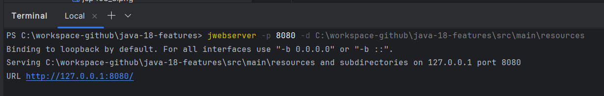
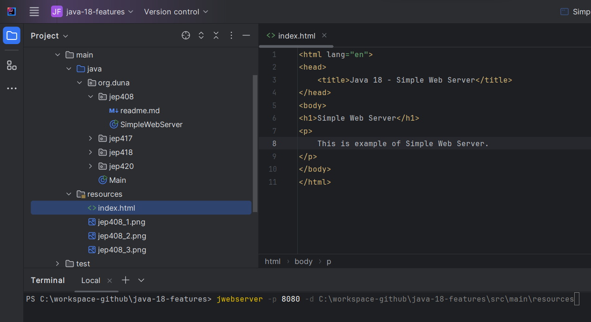
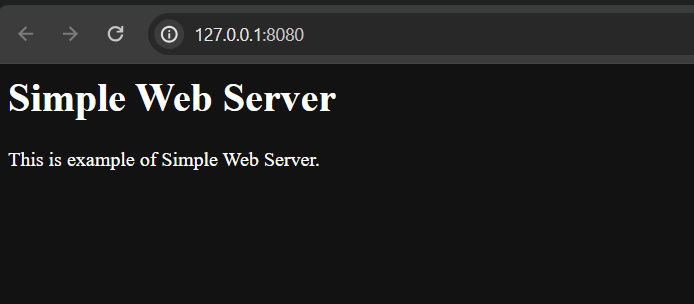

# Run 'Simple Web Server' from the terminal
### jwebserver, a command-line tool to start a minimal static web server, has been introduced. The tool and the accompanying API are located in the com.sun.net.httpserver package of the jdk.httpserver module and are designed to be used for prototyping, ad-hoc coding, and testing, particularly in educational contexts.
## Run jwebserver
### (Images for reference only)
### 1) Run jwebserver in the terminal and from the folder where the index.html file is located

### 2) The java web server will run.

### 3) Open from a web browser.
